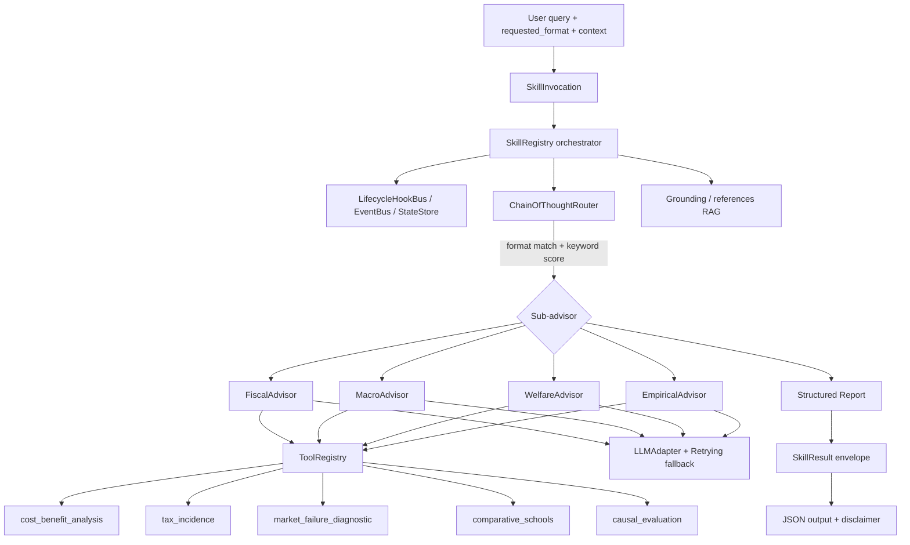

# Agent Architecture — Public Economic Policy Advisor

## Component responsibilities

| Component | Responsibility |
|---|---|
| `SkillRegistry` | Wires tools, sub-advisors, router, hooks, events, state; orchestrates one invocation end-to-end. |
| `ChainOfThoughtRouter` | Explicit, logged intent detection: format match -> keyword tie-break -> default. |
| `FiscalAdvisor` | Taxation, subsidies, cost-benefit analysis. Tools: `tax_incidence`, `cost_benefit_analysis`. |
| `MacroAdvisor` | Comparative schools, balanced pro/con. Tool: `comparative_schools`. |
| `WelfareAdvisor` | Market-failure diagnosis, distribution. Tool: `market_failure_diagnostic`. |
| `EmpiricalAdvisor` | Causal-evaluation method selection. Tool: `causal_evaluation`. |
| `ToolRegistry` | Resolves tools by name, validates I/O against declared JSON schemas, logs invocations. |
| `LLMAdapter` | Provider-agnostic; `RetryingLLMAdapter` adds bounded retries + graceful `MockLLMAdapter` fallback. |
| `Grounding` | Loads `references/*.md` into keyed snippets for RAG injection (token-budgeted). |
| Hooks | `LifecycleHookBus` (phase observers), `EventBus` (structured events), `StateStore` (snapshot/restore). |

## Data flow
1. `advise()` builds a `SkillInvocation`.
2. `SkillRegistry.invoke()` fires lifecycle hooks and emits events at each phase.
3. The router resolves a sub-advisor (auditable `RoutingDecision`).
4. The sub-advisor invokes deterministic tools and (optionally) the LLM adapter.
5. A typed report is wrapped in a `SkillResult` envelope, persisted to `StateStore`, and returned as JSON.
